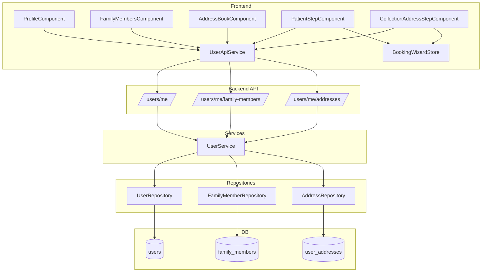
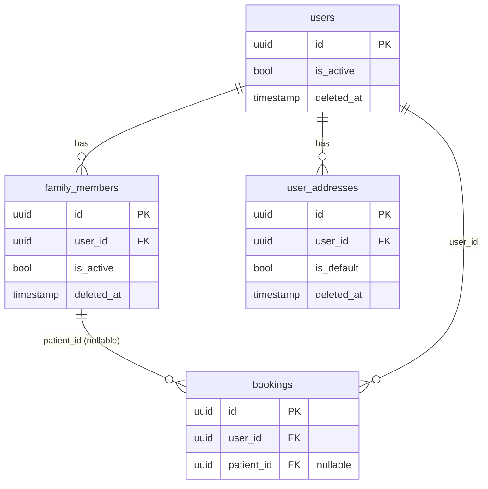

# Design Document: Family Members & Address Book

## Overview

This feature extends the diagnostic lab booking application with three capabilities:

1. **Address Book** — full-stack CRUD for saved user addresses, surfaced in the profile and used during home-collection booking.
2. **Family Members UX improvements** — inline edit, relationship dropdown, confirmation dialogs, duplicate-member guard, and `is_active` soft-delete flag.
3. **Booking Wizard corrections** — `patientId: null` for self-bookings, active-only family member filtering, saved-address selection in the collection step.

The backend is Python / FastAPI / SQLAlchemy async / PostgreSQL / Alembic / Pydantic v2. The frontend is Angular 17+ standalone components with NgRx Signals and Angular Material.

---

## Architecture



The design follows the existing repository → service → router layering. No new layers are introduced.

---

## Components and Interfaces

### Backend

#### `UserAddress` SQLAlchemy model (`backend/app/models/user.py`)

New model added to the existing `user.py` module alongside `User`, `Session`, and `FamilyMember`.

```python
class UserAddress(Base):
    __tablename__ = "user_addresses"

    id: Mapped[uuid.UUID]           # UUID PK
    user_id: Mapped[uuid.UUID]      # FK → users.id
    label: Mapped[str]              # VARCHAR(100)
    address_line1: Mapped[str]      # VARCHAR(255)
    address_line2: Mapped[str|None] # VARCHAR(255), nullable
    city: Mapped[str]               # VARCHAR(100)
    state: Mapped[str]              # VARCHAR(100)
    pincode: Mapped[str]            # VARCHAR(10)
    is_default: Mapped[bool]        # BOOLEAN, default false
    deleted_at: Mapped[datetime|None]
    created_at: Mapped[datetime]

    user: Mapped["User"]            # back-ref relationship
```

A partial unique index `uq_user_addresses_one_default` on `(user_id) WHERE is_default = true AND deleted_at IS NULL` is created in the Alembic migration (not via `__table_args__` on the model, to keep the model clean and let Alembic own DDL).

#### `FamilyMember` model update

Add `is_active: Mapped[bool]` (BOOLEAN, default `true`) to the existing `FamilyMember` class.

#### `AddressRepository` (`backend/app/repositories/address_repository.py`)

New file following the same pattern as `FamilyMemberRepository`.

| Method | Signature | Notes |
|---|---|---|
| `create` | `(user_id, label, address_line1, city, state, pincode, *, address_line2=None, is_default=False) → UserAddress` | Flushes and refreshes |
| `get_by_id` | `(address_id) → UserAddress \| None` | Excludes soft-deleted |
| `list_by_user` | `(user_id) → list[UserAddress]` | Excludes soft-deleted, ordered by `created_at DESC` |
| `update` | `(address_id, **fields) → UserAddress \| None` | Arbitrary field update |
| `soft_delete` | `(address_id) → None` | Sets `deleted_at = now()` |
| `clear_defaults` | `(user_id) → None` | Sets `is_default = false` for all non-deleted addresses of user |

#### `UserService` extensions (`backend/app/services/user_service.py`)

New methods added to the existing `UserService` class:

| Method | Behaviour |
|---|---|
| `get_addresses(user_id)` | Delegates to `AddressRepository.list_by_user` |
| `add_address(user_id, ...)` | If `is_default=True`, calls `clear_defaults` first, then `create` |
| `update_address(user_id, address_id, **fields)` | Ownership check → 404; if `is_default=True` in fields, calls `clear_defaults` first |
| `delete_address(user_id, address_id)` | Ownership check → 404; calls `soft_delete` |

Updated methods:

| Method | Change |
|---|---|
| `delete_family_member` | Also sets `is_active = false` via `FamilyMemberRepository.update(member_id, is_active=False)` |
| `add_family_member` | Before creating, queries for existing non-deleted member with same `(user_id, name, date_of_birth)`; raises HTTP 409 `DUPLICATE_FAMILY_MEMBER` if found |

#### Pydantic schemas (`backend/app/schemas/users.py`)

```python
class UserAddressOut(BaseModel):
    id: uuid.UUID
    user_id: uuid.UUID
    label: str
    address_line1: str
    address_line2: str | None
    city: str
    state: str
    pincode: str
    is_default: bool
    created_at: datetime
    model_config = {"from_attributes": True}

class CreateAddressRequest(BaseModel):
    label: str
    address_line1: str
    address_line2: str | None = None
    city: str
    state: str
    pincode: str
    is_default: bool = False

class UpdateAddressRequest(BaseModel):
    label: str | None = None
    address_line1: str | None = None
    address_line2: str | None = None
    city: str | None = None
    state: str | None = None
    pincode: str | None = None
    is_default: bool | None = None

class UserAddressListResponse(BaseModel):
    items: list[UserAddressOut]
    total: int
    page: int
    page_size: int
```

#### API router additions (`backend/app/api/v1/users.py`)

Four new endpoints added to the existing `router`:

```
GET    /users/me/addresses                  → UserAddressListResponse
POST   /users/me/addresses                  → UserAddressOut  (201)
PUT    /users/me/addresses/{address_id}     → UserAddressOut
DELETE /users/me/addresses/{address_id}     → 204
```

All use `Depends(get_current_user)` and `Depends(get_db_session)` consistent with existing endpoints.

#### Alembic migration `0006`

File: `backend/alembic/versions/0006_user_addresses_and_family_is_active.py`

```
revision = "0006"
down_revision = "0005"
```

`upgrade()` steps:
1. `op.create_table("user_addresses", ...)` with all columns.
2. `op.create_index("uq_user_addresses_one_default", "user_addresses", ["user_id"], unique=True, postgresql_where="is_default = true AND deleted_at IS NULL")`.
3. `op.add_column("family_members", sa.Column("is_active", sa.Boolean(), nullable=False, server_default="true"))`.

`downgrade()` reverses all three steps.

---

### Frontend

#### `api.types.ts` additions

```typescript
export interface UserAddress {
  id: string;
  user_id: string;
  label: string;
  address_line1: string;
  address_line2?: string;
  city: string;
  state: string;
  pincode: string;
  is_default: boolean;
  created_at: string;
}

export interface UserAddressListResponse {
  items: UserAddress[];
  total: number;
  page: number;
  page_size: number;
}
```

#### `UserApiService` additions

```typescript
getAddresses(): Observable<UserAddressListResponse>
addAddress(data: Partial<UserAddress>): Observable<UserAddress>
updateAddress(id: string, data: Partial<UserAddress>): Observable<UserAddress>
deleteAddress(id: string): Observable<void>
```

#### `AddressBookComponent` (`frontend/src/app/features/profile/address-book/`)

Standalone component at route `/profile/addresses`, protected by `authGuard`.

Responsibilities:
- On init: call `getAddresses()`, populate address list signal.
- Display each address card with label, lines, city/state/pincode, and a "Default" badge when `is_default`.
- Empty state: "No saved addresses yet."
- "Add Address" form (ReactiveFormsModule): label, address_line1, address_line2 (optional), city, state, pincode, is_default toggle. Inline validation with `mat-error` for required fields.
- "Remove" button per card → `MatDialog` confirmation → `deleteAddress()` → remove from list signal → `MatSnackBar` success toast.
- On add success: push to list, reset form, show success toast.
- On any API error: show error toast.
- Uses `*ngIf` / `*ngFor` (consistent with `FamilyMembersComponent`).

#### `FamilyMembersComponent` updates

- Add "Edit" button per card.
- Clicking "Edit" sets `editingId` signal to that member's id; shows inline edit form pre-populated via a `FormGroup`.
- Relationship field: `MatSelect` with options `['Father','Mother','Child','Spouse','Sibling','Grandparent','Grandchild','Other']` (both add and edit forms).
- "Cancel" hides form, clears `editingId`, no API call.
- "Save" calls `updateFamilyMember()`, updates list signal on success, shows success toast.
- "Remove" button → `MatDialog` confirmation → `deleteFamilyMember()` → filter list → success toast.
- All API errors show error toast via `MatSnackBar`.
- Inline validation: `name` and `relationship` required, show `mat-error` before submit.
- Continues to use `*ngIf` / `*ngFor` (not `@if`/`@for`).

#### `ProfileComponent` tile cleanup

Remove "About" and "Lab Locator" tiles. Fix "Manage Members" route to `/profile/family`. Final `tiles` array order:

```
My Profile       → /profile/edit
Manage Members   → /profile/family
Address Book     → /profile/addresses
Download Reports → /dashboard
My Orders        → /dashboard
Help             → /help
Contact Us       → /contact
```

#### `profile.routes.ts` addition

```typescript
{
  path: 'addresses',
  loadComponent: () => import('./address-book/address-book.component')
    .then(m => m.AddressBookComponent),
  canActivate: [authGuard],
}
```

#### `PatientStepComponent` fixes

- `onNext()`: when `selectedId === 'self'`, store `patientId: null` (not `profile()?.id`).
- `familyMembers` signal: filter API response to only include members where `is_active === true` (once `FamilyMember` interface gains `is_active`).

#### `BookingWizardStore` addition

Add `selectedAddressId: string | null` to `BookingWizardState` and `initialState`.

#### `CollectionAddressStepComponent` (new or updated)

When collection type is `'home'`:
- On init: call `getAddresses()`.
- Pre-select the address where `is_default === true`.
- Show selectable address cards; selecting one calls `patchState({ selectedAddressId, pincode })`.
- "Enter new address" option shows a manual pincode input.
- If no saved addresses exist, show manual entry directly.
- Uses `@if`/`@for` control flow (consistent with `PatientStepComponent`).

---

## Data Models

### `user_addresses` table

| Column | Type | Constraints |
|---|---|---|
| `id` | UUID | PK, default `gen_random_uuid()` |
| `user_id` | UUID | FK → `users.id`, NOT NULL |
| `label` | VARCHAR(100) | NOT NULL |
| `address_line1` | VARCHAR(255) | NOT NULL |
| `address_line2` | VARCHAR(255) | NULL |
| `city` | VARCHAR(100) | NOT NULL |
| `state` | VARCHAR(100) | NOT NULL |
| `pincode` | VARCHAR(10) | NOT NULL |
| `is_default` | BOOLEAN | NOT NULL, default `false` |
| `deleted_at` | TIMESTAMPTZ | NULL |
| `created_at` | TIMESTAMPTZ | NOT NULL, default `now()` |

Partial unique index: `(user_id) WHERE is_default = true AND deleted_at IS NULL`

### `family_members` table — added column

| Column | Type | Constraints |
|---|---|---|
| `is_active` | BOOLEAN | NOT NULL, default `true` |

### `BookingWizardState` — added field

| Field | Type | Default |
|---|---|---|
| `selectedAddressId` | `string \| null` | `null` |

### Entity Relationship



---


## Correctness Properties

*A property is a characteristic or behavior that should hold true across all valid executions of a system — essentially, a formal statement about what the system should do. Properties serve as the bridge between human-readable specifications and machine-verifiable correctness guarantees.*

### Property 1: Address serialization round-trip

*For any* valid `UserAddress` object, serializing it to a `UserAddressOut` Pydantic schema and back should produce an equivalent object with all fields preserved.

**Validates: Requirements 1.1, 3.1**

---

### Property 2: At most one default address per user

*For any* user and any sequence of address create/update operations that set `is_default: true`, after each operation the count of non-deleted addresses with `is_default = true` for that user must be exactly one (or zero if no addresses exist).

**Validates: Requirements 1.3, 2.6, 2.7**

---

### Property 3: List endpoint excludes soft-deleted addresses

*For any* user with any mix of active and soft-deleted addresses, `GET /users/me/addresses` must return only addresses where `deleted_at IS NULL`.

**Validates: Requirements 2.1**

---

### Property 4: Address create/delete round-trip

*For any* valid `CreateAddressRequest`, after `POST /users/me/addresses` the new address must appear in `GET /users/me/addresses`; after `DELETE /users/me/addresses/{id}` the same address must no longer appear in the list.

**Validates: Requirements 2.2, 2.4**

---

### Property 5: Address update reflects changes

*For any* existing address and any valid `UpdateAddressRequest`, after `PUT /users/me/addresses/{id}` the returned record must reflect all updated fields.

**Validates: Requirements 2.3**

---

### Property 6: Wrong-owner or deleted address returns 404

*For any* address_id that either does not exist, is soft-deleted, or belongs to a different user, any mutating or read request targeting that address_id must return HTTP 404 with error code `ADDRESS_NOT_FOUND`.

**Validates: Requirements 2.5**

---

### Property 7: Missing required fields return 422

*For any* `CreateAddressRequest` or `UpdateAddressRequest` where at least one of `label`, `address_line1`, `city`, `state`, or `pincode` is an empty string or missing, the system must return HTTP 422.

**Validates: Requirements 2.8**

---

### Property 8: List response uses paginated envelope

*For any* call to `GET /users/me/addresses`, the response must conform to the `UserAddressListResponse` shape with `items`, `total`, `page`, and `page_size` fields present.

**Validates: Requirements 3.4**

---

### Property 9: Address cards display all required fields

*For any* `UserAddress`, the rendered address card must contain the label, address_line1, city, state, and pincode values from that address.

**Validates: Requirements 4.4**

---

### Property 10: Default badge shown for default address

*For any* `UserAddress` where `is_default = true`, the rendered card must include a "Default" badge; for any address where `is_default = false`, no such badge must appear.

**Validates: Requirements 4.5**

---

### Property 11: Valid add-address form submission adds to list

*For any* valid address form input, after submitting the "Add Address" form the new address must appear in the displayed address list and the form must be reset to empty.

**Validates: Requirements 4.7**

---

### Property 12: Confirmed deletion removes card from list

*For any* address card, after the user confirms the deletion dialog, the address must no longer appear in the displayed list.

**Validates: Requirements 4.9**

---

### Property 13: Success toast on any successful mutation

*For any* successful add, update, or delete operation on either an address or a family member, a success toast/snackbar notification must be displayed.

**Validates: Requirements 4.10, 7.7**

---

### Property 14: Error toast on any API failure

*For any* failed API call (address or family member), an error toast/snackbar notification must be displayed.

**Validates: Requirements 4.11, 7.6**

---

### Property 15: Inline validation shows errors before submit

*For any* add or edit form (address or family member) where a required field is empty or invalid, field-level error messages must be visible before the form is submitted.

**Validates: Requirements 4.12, 7.8**

---

### Property 16: Duplicate name+DOB returns 409

*For any* user who already has a non-deleted family member with a given `(name, date_of_birth)` combination, a `POST /users/me/family-members` request with the same combination must return HTTP 409 with error code `DUPLICATE_FAMILY_MEMBER`.

**Validates: Requirements 7.10**

---

### Property 17: Soft-delete sets both deleted_at and is_active=false

*For any* family member, after a soft-delete operation, the record must have `deleted_at` set to a non-null UTC timestamp and `is_active` set to `false`.

**Validates: Requirements 8.1**

---

### Property 18: Soft-deleted family members excluded from list

*For any* user with any mix of active and soft-deleted family members, `GET /users/me/family-members` must return only members where `deleted_at IS NULL`.

**Validates: Requirements 8.3**

---

### Property 19: Edit form pre-populated with member data

*For any* family member, when the edit form is opened for that member, the form fields must be pre-populated with that member's current `name`, `relationship`, `date_of_birth`, and `gender` values.

**Validates: Requirements 7.2**

---

### Property 20: Relationship field rejects values outside allowed list

*For any* relationship value not in `['Father','Mother','Child','Spouse','Sibling','Grandparent','Grandchild','Other']`, the add or edit form must be invalid and must not submit.

**Validates: Requirements 7.3**

---

### Property 21: Edit submission updates displayed card

*For any* valid edit form submission, after `PUT /users/me/family-members/{id}` succeeds, the displayed card for that member must reflect the updated field values.

**Validates: Requirements 7.4**

---

### Property 22: Family member selection stores correct patientId

*For any* family member selected in `PatientStepComponent`, `BookingWizardStore.patientId` must equal that member's UUID; when "Myself" is selected, `patientId` must be `null`.

**Validates: Requirements 9.1, 9.2**

---

### Property 23: patientName stored for any patient selection

*For any* patient selection (self or family member), `BookingWizardStore.patientName` must be set to the patient's display name.

**Validates: Requirements 9.5**

---

### Property 24: Only active family members shown in patient step

*For any* list of family members that includes soft-deleted members, `PatientStepComponent` must only display members where `is_active = true` and `deleted_at IS NULL`.

**Validates: Requirements 9.6**

---

### Property 25: Home collection step loads and displays saved addresses

*For any* user with saved addresses, when the collection type is home collection, the `CollectionAddressStepComponent` must display all non-deleted saved addresses.

**Validates: Requirements 10.1**

---

### Property 26: Default address is pre-selected

*For any* address list containing a default address (`is_default = true`), the `CollectionAddressStepComponent` must pre-select that address on load.

**Validates: Requirements 10.2**

---

### Property 27: Selected address pincode stored in BookingWizardStore

*For any* saved address selected in `CollectionAddressStepComponent`, `BookingWizardStore.pincode` must be set to that address's `pincode` value and `selectedAddressId` must be set to that address's `id`.

**Validates: Requirements 10.3, 10.5**

---

## Error Handling

### Backend

| Scenario | HTTP Status | Error Code |
|---|---|---|
| Address not found / soft-deleted / wrong owner | 404 | `ADDRESS_NOT_FOUND` |
| Family member not found / wrong owner | 404 | `FAMILY_MEMBER_NOT_FOUND` |
| Duplicate family member (name+DOB) | 409 | `DUPLICATE_FAMILY_MEMBER` |
| Family member limit exceeded (>10) | 422 | `FAMILY_MEMBER_LIMIT_EXCEEDED` |
| Missing/empty required address fields | 422 | (Pydantic validation detail) |
| User not found | 404 | `USER_NOT_FOUND` |

All error responses follow the existing pattern:
```json
{"detail": {"error_code": "...", "message": "..."}}
```

The `clear_defaults` operation is called inside the same database transaction as the create/update, so if the subsequent write fails, the defaults are not cleared (atomicity guaranteed by SQLAlchemy's session flush/rollback).

### Frontend

- All HTTP errors from `UserApiService` are caught in component `error` callbacks.
- `MatSnackBar` is used for all toast notifications (success and error), consistent with existing patterns.
- `MatDialog` is used for all confirmation dialogs before destructive operations.
- Form validation errors are shown via `mat-error` inside `mat-form-field` only after the field is touched or the form is submitted.
- Loading states are shown via existing `LoadingSpinnerComponent` or inline skeleton patterns.

---

## Testing Strategy

### Dual Testing Approach

Both unit tests and property-based tests are required. They are complementary:
- Unit tests cover specific examples, integration points, and edge cases.
- Property-based tests verify universal invariants across many generated inputs.

### Property-Based Testing

**Library**: [`hypothesis`](https://hypothesis.readthedocs.io/) for Python backend; [`fast-check`](https://fast-check.dev/) for Angular frontend.

Each property-based test must run a minimum of **100 iterations**.

Each test must be tagged with a comment in the format:
```
# Feature: family-members-address-book, Property N: <property_text>
```

Mapping of design properties to test files:

| Property | Test file | Pattern |
|---|---|---|
| P1 Address serialization round-trip | `tests/properties/test_property_address_serialization.py` | Round-trip |
| P2 At most one default per user | `tests/properties/test_property_address_default_invariant.py` | Invariant |
| P3 List excludes soft-deleted addresses | `tests/properties/test_property_address_list_excludes_deleted.py` | Invariant |
| P4 Address create/delete round-trip | `tests/properties/test_property_address_create_delete.py` | Round-trip |
| P5 Update reflects changes | `tests/properties/test_property_address_update.py` | Metamorphic |
| P6 Wrong-owner/deleted → 404 | `tests/properties/test_property_address_not_found.py` | Error condition |
| P7 Missing required fields → 422 | `tests/properties/test_property_address_validation.py` | Error condition |
| P16 Duplicate name+DOB → 409 | `tests/properties/test_property_family_member_duplicate.py` | Error condition |
| P17 Soft-delete sets flags | `tests/properties/test_property_family_member_soft_delete.py` | Invariant |
| P18 Soft-deleted excluded from list | `tests/properties/test_property_family_member_list.py` | Invariant |

Frontend property tests (fast-check, in component spec files):

| Property | Test location |
|---|---|
| P10 Default badge | `address-book.component.spec.ts` |
| P11 Add form → list | `address-book.component.spec.ts` |
| P20 Relationship validation | `family-members.component.spec.ts` |
| P22 patientId storage | `patient-step.component.spec.ts` |
| P24 Active-only members | `patient-step.component.spec.ts` |
| P27 Pincode in store | `collection-address-step.component.spec.ts` |

### Unit Tests

Unit tests focus on:
- Specific examples: profile tile order (P6.4), route registration (P4.1), edit cancel behavior (P7.5).
- Integration points: `UserService.add_address` calls `clear_defaults` before `create` when `is_default=True`.
- Edge cases: empty address list shows manual entry (Req 10.6), empty state message (Req 4.3).

Avoid writing unit tests that duplicate what property tests already cover (e.g., don't write a unit test for "adding an address increases list length by 1" if the round-trip property test already covers it).

### Test Configuration

```toml
# backend/pyproject.toml — hypothesis settings
[tool.pytest.ini_options]
addopts = "--hypothesis-seed=0"

# Per-test decorator
@settings(max_examples=100)
```

```typescript
// frontend — fast-check configuration
fc.assert(fc.property(...), { numRuns: 100 });
```
