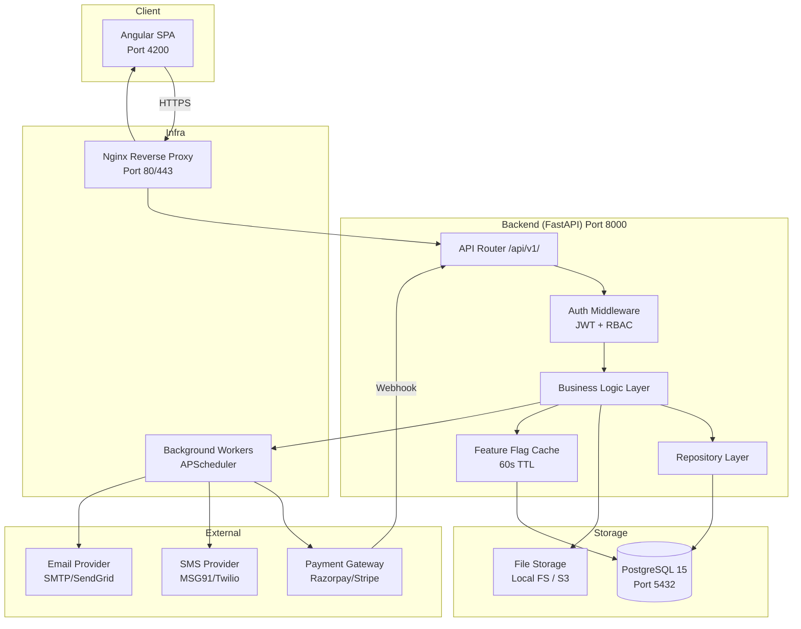
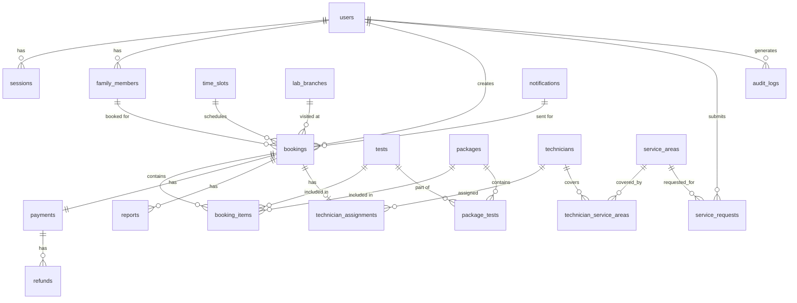
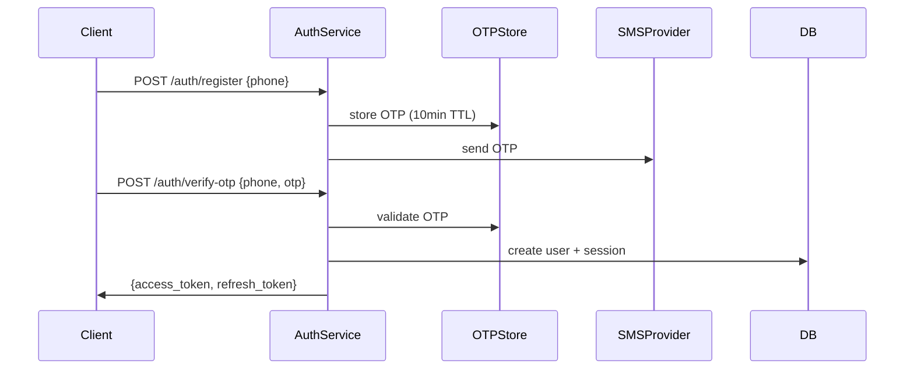
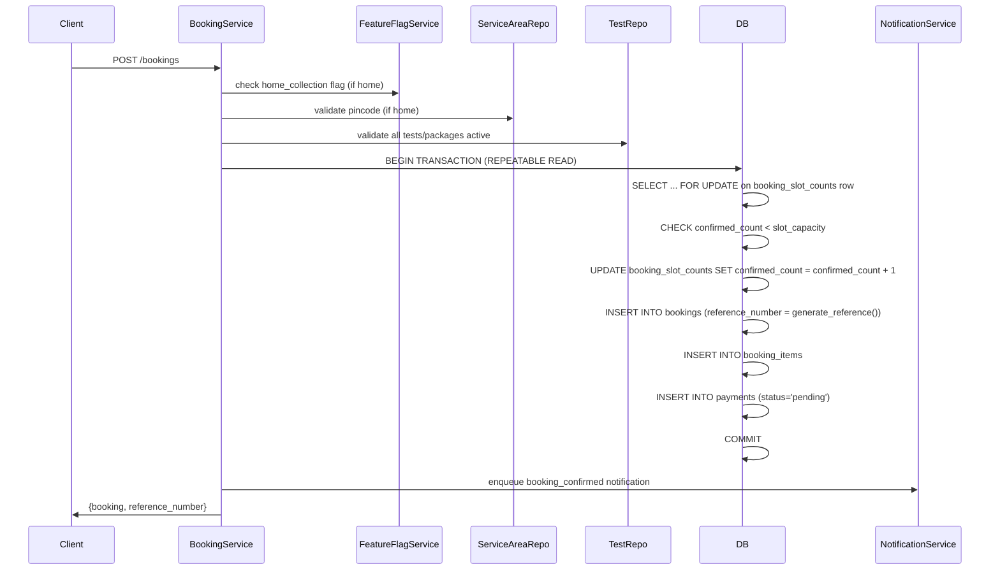
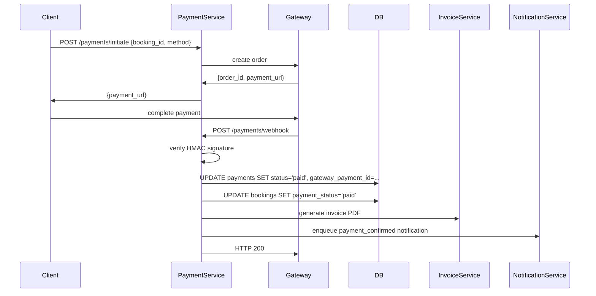

# Design Document: SRI Diagnostic Laboratory & Health Care

## Overview

SRI Diagnostic Laboratory & Health Care is a full-stack diagnostic lab platform that enables patients to book tests online or schedule home sample collection, track sample status, download reports, and manage family health records. Lab technicians manage assigned bookings and upload reports. Admins have full control over tests, packages, pricing, service areas, technicians, and analytics.

The system is built with:
- **Backend**: Python 3.11 + FastAPI (async, Pydantic v2)
- **Frontend**: Angular 17 (standalone components, signals)
- **Database**: PostgreSQL 15
- **Migrations**: Alembic
- **File Storage**: Pluggable — local filesystem or S3-compatible object store
- **Notifications**: SMS (e.g., Twilio/MSG91) + Email (SMTP/SendGrid)
- **Payments**: Payment gateway (Razorpay/Stripe) with webhook support
- **DevOps**: Docker Compose, GitHub Actions CI/CD


## Architecture

### System Architecture Diagram



### Request Flow

1. Angular SPA sends HTTPS requests to Nginx reverse proxy
2. Nginx routes `/api/v1/*` to FastAPI backend, static assets to Angular build
3. FastAPI middleware validates JWT, enforces RBAC, checks feature flags
4. Business logic layer executes domain operations via repository layer
5. Repository layer interacts with PostgreSQL using SQLAlchemy async ORM
6. Background workers handle notifications, archival, and backup tasks asynchronously

### Key Architectural Decisions

- **Async FastAPI**: All I/O-bound operations (DB, file storage, external APIs) use `async/await` for throughput
- **Repository pattern**: Decouples business logic from ORM, enabling testability
- **Pluggable file storage**: `StorageBackend` interface with `LocalStorage` and `S3Storage` implementations
- **Feature flags in DB with in-process cache**: Avoids Redis dependency while meeting 60s propagation requirement
- **Serializable transactions for bookings**: Prevents double-booking race conditions at DB level


## Components and Interfaces

### Backend Components

#### API Layer (`app/api/v1/`)

| Router | Prefix | Key Endpoints |
|--------|--------|---------------|
| auth | `/auth` | POST /register, POST /login, POST /logout, POST /refresh, GET /sessions, DELETE /sessions/{id} |
| users | `/users` | GET/PUT /me, GET/POST/PUT/DELETE /me/family-members |
| tests | `/tests` | CRUD + GET /tests?q=&category= |
| packages | `/packages` | CRUD + GET /packages |
| bookings | `/bookings` | POST /, GET /, GET /{id}, POST /{id}/cancel, POST /{id}/reschedule, PUT /{id}/status |
| reports | `/reports` | POST /upload, GET /{id}/download-url |
| payments | `/payments` | POST /initiate, POST /webhook, POST /{id}/refund |
| service-areas | `/service-areas` | CRUD + POST /notify-me |
| technicians | `/technicians` | CRUD + POST /{id}/assign, GET /workload |
| time-slots | `/time-slots` | CRUD + GET /available |
| lab-branches | `/lab-branches` | CRUD |
| admin | `/admin` | GET /dashboard, GET /analytics, GET /audit-logs |
| feature-flags | `/feature-flags` | CRUD |
| health | `/health` | GET / |
| metrics | `/metrics` | GET / |

#### Service Layer (`app/services/`)

- `AuthService`: OTP generation/verification, JWT issuance, session management, rate limiting
- `BookingService`: Booking creation with atomic slot decrement, reference number generation, status transitions
- `PaymentService`: Gateway integration, webhook verification, refund processing
- `NotificationService`: SMS/email dispatch with retry queue
- `ReportService`: File upload/download, signed URL generation
- `FeatureFlagService`: DB-backed flags with TTL cache
- `AnalyticsService`: Dashboard metrics aggregation
- `ArchivalService`: Scheduled archival of records > 3 years old
- `BackupService`: Scheduled PostgreSQL dumps

#### Repository Layer (`app/repositories/`)

One repository per aggregate root: `UserRepository`, `BookingRepository`, `TestRepository`, `PackageRepository`, `PaymentRepository`, `ReportRepository`, `TechnicianRepository`, `ServiceAreaRepository`, `TimeSlotRepository`, `LabBranchRepository`, `AuditLogRepository`, `FeatureFlagRepository`, `NotificationRepository`

#### Middleware (`app/middleware/`)

- `JWTAuthMiddleware`: Validates Bearer token, injects `request.state.user`
- `RBACMiddleware`: Checks role permissions per endpoint
- `RateLimitMiddleware`: Sliding window counter per IP (login/OTP endpoints)
- `AuditMiddleware`: Logs 401/403 responses
- `RequestLoggingMiddleware`: Structured JSON request logs
- `SecurityHeadersMiddleware`: CSP, X-Content-Type-Options, X-Frame-Options

### Frontend Components (Angular)

#### Module Structure

```
src/app/
├── core/                    # Singleton services, interceptors, guards
│   ├── auth/                # AuthService, JwtInterceptor, AuthGuard, RoleGuard, redirectIfAuthenticated
│   ├── api/                 # ApiService (base HTTP), typed API clients
│   └── store/               # Signal-based state (SignalStore pattern)
├── shared/                  # Reusable UI components
│   ├── loading-spinner/
│   ├── empty-state/
│   ├── error-banner/
│   └── pagination/
├── features/
│   ├── auth/                # Login, Register, OTP verification pages
│   ├── dashboard/           # User dashboard, booking list  [protected]
│   ├── tests/               # Test catalog, search, detail  [public]
│   ├── packages/            # Package listing               [public]
│   ├── booking/             # Booking wizard (multi-step)   [protected]
│   ├── reports/             # Report list, download         [protected]
│   ├── profile/             # User profile, family members  [protected]
│   ├── payments/            # Payment flow, invoice download [protected]
│   └── admin/               # Admin dashboard, analytics, management pages [admin only]
└── app.routes.ts            # Lazy-loaded route definitions
```

#### Route Access Model (Public-First)

The app defaults to public browsing. Login is only required for transactional actions.

| Route | Guard | Notes |
|-------|-------|-------|
| `/tests`, `/tests/:id` | none | Public catalog |
| `/packages` | none | Public catalog |
| `/auth/login`, `/auth/register` | `redirectIfAuthenticated` | Bounce logged-in users to `/tests` |
| `/booking` | `authGuard` | Redirects to `/auth/login?returnUrl=/booking` |
| `/dashboard` | `authGuard` | User's booking history |
| `/reports` | `authGuard` | User's reports |
| `/profile`, `/profile/family` | `authGuard` | User profile |
| `/payments` | `authGuard` | Payment flow |
| `/admin/*` | `authGuard` + `roleGuard(['admin'])` | Admin only |

After login, users are redirected to the `returnUrl` query param (the page they originally tried to visit), falling back to `/dashboard`.

#### Key Angular Services

- `AuthStateService`: Manages JWT tokens in memory + refresh token in HttpOnly cookie
- `BookingWizardService`: Multi-step booking state (patient, tests, slot, payment)
- `FeatureFlagService`: Fetches and caches feature flags for conditional UI rendering
- `NotificationService` (frontend): Toast/snackbar display

#### State Management

**Chosen approach**: Angular Signals (Angular 17+) for local and shared component state.

- `signal()`, `computed()`, and `effect()` are used for reactive state throughout the application
- Feature-level state (e.g., booking wizard steps, auth state) uses a lightweight `SignalStore` pattern from `@ngrx/signals`
- Full NgRx store is not used in the MVP — `@ngrx/signals` provides the right balance of reactivity without boilerplate

#### UX State Management

Every data-fetching component implements three states:
1. **Loading**: Spinner shown, controls disabled
2. **Empty**: Contextual empty-state message with action CTA
3. **Error**: Human-readable message from API `message` field + retry button


## Data Models

### Entity Relationship Diagram



### Table Definitions

#### `users`
| Column | Type | Constraints |
|--------|------|-------------|
| id | UUID | PK, default gen_random_uuid() |
| phone | VARCHAR(20) | UNIQUE, nullable |
| email | VARCHAR(255) | UNIQUE, nullable |
| password_hash | VARCHAR(255) | NOT NULL |
| name | VARCHAR(255) | NOT NULL |
| date_of_birth | DATE | nullable |
| gender | VARCHAR(10) | nullable |
| role | VARCHAR(20) | NOT NULL, default 'user' |
| is_active | BOOLEAN | NOT NULL, default true |
| deleted_at | TIMESTAMPTZ | nullable |
| created_at | TIMESTAMPTZ | NOT NULL, default now() |
| updated_at | TIMESTAMPTZ | NOT NULL, default now() |

#### `sessions`
| Column | Type | Constraints |
|--------|------|-------------|
| id | UUID | PK |
| user_id | UUID | FK users.id |
| refresh_token_hash | VARCHAR(255) | NOT NULL, UNIQUE |
| device_identifier | VARCHAR(255) | nullable |
| ip_address | INET | nullable |
| last_seen_at | TIMESTAMPTZ | NOT NULL |
| expires_at | TIMESTAMPTZ | NOT NULL |
| revoked_at | TIMESTAMPTZ | nullable |
| created_at | TIMESTAMPTZ | NOT NULL |

#### `family_members`
| Column | Type | Constraints |
|--------|------|-------------|
| id | UUID | PK |
| user_id | UUID | FK users.id |
| name | VARCHAR(255) | NOT NULL |
| date_of_birth | DATE | nullable |
| gender | VARCHAR(10) | nullable |
| relationship | VARCHAR(50) | NOT NULL |
| deleted_at | TIMESTAMPTZ | nullable |
| created_at | TIMESTAMPTZ | NOT NULL |

#### `tests`
| Column | Type | Constraints |
|--------|------|-------------|
| id | UUID | PK |
| name | VARCHAR(255) | NOT NULL |
| category | VARCHAR(50) | NOT NULL |
| description | TEXT | nullable |
| price | NUMERIC(10,2) | NOT NULL |
| discount_percentage | NUMERIC(5,2) | NOT NULL, default 0 |
| turnaround_hours | INTEGER | NOT NULL |
| is_active | BOOLEAN | NOT NULL, default true |
| deleted_at | TIMESTAMPTZ | nullable |
| search_vector | TSVECTOR | generated (for full-text search) |
| created_at | TIMESTAMPTZ | NOT NULL |
| updated_at | TIMESTAMPTZ | NOT NULL |

Indexes: `GIN(search_vector)`, `BTREE(category)`, trigram index on `name`

#### `packages`
| Column | Type | Constraints |
|--------|------|-------------|
| id | UUID | PK |
| name | VARCHAR(255) | NOT NULL |
| description | TEXT | nullable |
| original_price | NUMERIC(10,2) | NOT NULL |
| discounted_price | NUMERIC(10,2) | NOT NULL |
| is_active | BOOLEAN | NOT NULL, default true |
| deleted_at | TIMESTAMPTZ | nullable |
| created_at | TIMESTAMPTZ | NOT NULL |
| updated_at | TIMESTAMPTZ | NOT NULL |

#### `package_tests`
| Column | Type | Constraints |
|--------|------|-------------|
| package_id | UUID | FK packages.id |
| test_id | UUID | FK tests.id |
| PRIMARY KEY | (package_id, test_id) | |

#### `service_areas`
| Column | Type | Constraints |
|--------|------|-------------|
| id | UUID | PK |
| district | VARCHAR(100) | NOT NULL |
| city | VARCHAR(100) | NOT NULL |
| pincode | VARCHAR(10) | NOT NULL, UNIQUE |
| is_active | BOOLEAN | NOT NULL, default true |
| created_at | TIMESTAMPTZ | NOT NULL |

#### `service_requests`
| Column | Type | Constraints |
|--------|------|-------------|
| id | UUID | PK |
| user_id | UUID | FK users.id |
| pincode | VARCHAR(10) | NOT NULL |
| notified_at | TIMESTAMPTZ | nullable |
| created_at | TIMESTAMPTZ | NOT NULL |
| UNIQUE | (user_id, pincode) where notified_at IS NULL | |

#### `lab_branches`
| Column | Type | Constraints |
|--------|------|-------------|
| id | UUID | PK |
| name | VARCHAR(255) | NOT NULL |
| address | TEXT | NOT NULL |
| city | VARCHAR(100) | NOT NULL |
| pincode | VARCHAR(10) | NOT NULL |
| phone | VARCHAR(20) | NOT NULL |
| operating_hours | VARCHAR(255) | NOT NULL |
| is_active | BOOLEAN | NOT NULL, default true |
| created_at | TIMESTAMPTZ | NOT NULL |

#### `time_slots`
| Column | Type | Constraints |
|--------|------|-------------|
| id | UUID | PK |
| start_time | TIME | NOT NULL |
| end_time | TIME | NOT NULL |
| collection_type | VARCHAR(20) | NOT NULL ('home'/'lab') |
| days_of_week | INTEGER[] | NOT NULL (0=Mon..6=Sun) |
| slot_capacity | INTEGER | NOT NULL |
| is_active | BOOLEAN | NOT NULL, default true |
| created_at | TIMESTAMPTZ | NOT NULL |

#### `bookings`
| Column | Type | Constraints |
|--------|------|-------------|
| id | UUID | PK |
| reference_number | VARCHAR(20) | NOT NULL, UNIQUE |
| user_id | UUID | FK users.id |
| patient_id | UUID | nullable, FK family_members.id |
| collection_type | VARCHAR(20) | NOT NULL |
| time_slot_id | UUID | FK time_slots.id |
| booking_date | DATE | NOT NULL |
| lab_branch_id | UUID | nullable, FK lab_branches.id |
| pincode | VARCHAR(10) | nullable |
| status | VARCHAR(20) | NOT NULL, default 'booked' |
| payment_status | VARCHAR(20) | NOT NULL, default 'pending' |
| collected_at | TIMESTAMPTZ | nullable |
| processing_started_at | TIMESTAMPTZ | nullable |
| completed_at | TIMESTAMPTZ | nullable |
| cancelled_at | TIMESTAMPTZ | nullable |
| created_at | TIMESTAMPTZ | NOT NULL |
| updated_at | TIMESTAMPTZ | NOT NULL |

#### `booking_slot_counts`
| Column | Type | Constraints |
|--------|------|-------------|
| time_slot_id | UUID | FK time_slots.id |
| booking_date | DATE | NOT NULL |
| confirmed_count | INTEGER | NOT NULL, default 0 |
| PRIMARY KEY | (time_slot_id, booking_date) | |

This table is the authoritative counter for slot capacity. Incremented/decremented atomically within booking transactions.

#### `booking_items`
| Column | Type | Constraints |
|--------|------|-------------|
| id | UUID | PK |
| booking_id | UUID | FK bookings.id |
| item_type | VARCHAR(10) | NOT NULL ('test'/'package') |
| test_id | UUID | nullable, FK tests.id |
| package_id | UUID | nullable, FK packages.id |
| unit_price | NUMERIC(10,2) | NOT NULL |
| created_at | TIMESTAMPTZ | NOT NULL |

#### `payments`
| Column | Type | Constraints |
|--------|------|-------------|
| id | UUID | PK |
| booking_id | UUID | FK bookings.id, UNIQUE |
| method | VARCHAR(20) | NOT NULL |
| status | VARCHAR(20) | NOT NULL, default 'pending' |
| gateway_order_id | VARCHAR(255) | nullable |
| gateway_payment_id | VARCHAR(255) | nullable, UNIQUE |
| amount | NUMERIC(10,2) | NOT NULL |
| gst_amount | NUMERIC(10,2) | NOT NULL, default 0 |
| invoice_number | VARCHAR(50) | nullable, UNIQUE |
| paid_at | TIMESTAMPTZ | nullable |
| created_at | TIMESTAMPTZ | NOT NULL |
| updated_at | TIMESTAMPTZ | NOT NULL |

#### `refunds`
| Column | Type | Constraints |
|--------|------|-------------|
| id | UUID | PK |
| payment_id | UUID | FK payments.id |
| amount | NUMERIC(10,2) | NOT NULL |
| reason | TEXT | NOT NULL |
| gateway_refund_id | VARCHAR(255) | nullable |
| status | VARCHAR(20) | NOT NULL |
| initiated_by | UUID | FK users.id |
| initiated_at | TIMESTAMPTZ | NOT NULL |
| completed_at | TIMESTAMPTZ | nullable |

#### `technicians`
| Column | Type | Constraints |
|--------|------|-------------|
| id | UUID | PK |
| user_id | UUID | FK users.id, UNIQUE |
| name | VARCHAR(255) | NOT NULL |
| phone | VARCHAR(20) | NOT NULL |
| email | VARCHAR(255) | NOT NULL |
| is_active | BOOLEAN | NOT NULL, default true |
| deleted_at | TIMESTAMPTZ | nullable |
| created_at | TIMESTAMPTZ | NOT NULL |

#### `technician_service_areas`
| Column | Type | Constraints |
|--------|------|-------------|
| technician_id | UUID | FK technicians.id |
| service_area_id | UUID | FK service_areas.id |
| PRIMARY KEY | (technician_id, service_area_id) | |

#### `technician_assignments`
| Column | Type | Constraints |
|--------|------|-------------|
| id | UUID | PK |
| booking_id | UUID | FK bookings.id, UNIQUE |
| technician_id | UUID | FK technicians.id |
| assigned_at | TIMESTAMPTZ | NOT NULL |
| assigned_by | UUID | FK users.id |

#### `reports`
| Column | Type | Constraints |
|--------|------|-------------|
| id | UUID | PK |
| booking_id | UUID | FK bookings.id |
| storage_key | VARCHAR(500) | NOT NULL |
| file_name | VARCHAR(255) | NOT NULL |
| file_size_bytes | INTEGER | NOT NULL |
| uploaded_by | UUID | FK users.id |
| uploader_role | VARCHAR(20) | NOT NULL |
| uploaded_at | TIMESTAMPTZ | NOT NULL |
| retention_until | DATE | NOT NULL (uploaded_at + 7 years) |

#### `notifications`
| Column | Type | Constraints |
|--------|------|-------------|
| id | UUID | PK |
| booking_id | UUID | nullable, FK bookings.id |
| user_id | UUID | FK users.id |
| channel | VARCHAR(10) | NOT NULL ('sms'/'email') |
| event_type | VARCHAR(50) | NOT NULL |
| status | VARCHAR(20) | NOT NULL ('pending'/'sent'/'failed') |
| attempt_count | INTEGER | NOT NULL, default 0 |
| last_attempted_at | TIMESTAMPTZ | nullable |
| sent_at | TIMESTAMPTZ | nullable |
| error_message | TEXT | nullable |
| created_at | TIMESTAMPTZ | NOT NULL |

#### `audit_logs`
| Column | Type | Constraints |
|--------|------|-------------|
| id | UUID | PK |
| actor_id | UUID | nullable (null for anonymous) |
| actor_role | VARCHAR(20) | nullable |
| action_type | VARCHAR(100) | NOT NULL |
| entity_type | VARCHAR(100) | NOT NULL |
| entity_id | VARCHAR(255) | NOT NULL |
| outcome | VARCHAR(20) | NOT NULL ('success'/'failure') |
| source_ip | INET | nullable |
| metadata | JSONB | nullable |
| created_at | TIMESTAMPTZ | NOT NULL |

No UPDATE or DELETE permissions granted to application DB user on this table.

#### `feature_flags`
| Column | Type | Constraints |
|--------|------|-------------|
| id | UUID | PK |
| key | VARCHAR(100) | NOT NULL, UNIQUE |
| is_enabled | BOOLEAN | NOT NULL, default false |
| description | TEXT | nullable |
| updated_by | UUID | nullable, FK users.id |
| updated_at | TIMESTAMPTZ | NOT NULL |
| created_at | TIMESTAMPTZ | NOT NULL |

#### `booking_status_history`
| Column | Type | Constraints |
|--------|------|-------------|
| id | UUID | PK |
| booking_id | UUID | FK bookings.id |
| from_status | VARCHAR(20) | nullable |
| to_status | VARCHAR(20) | NOT NULL |
| changed_by | UUID | FK users.id |
| changed_at | TIMESTAMPTZ | NOT NULL |

#### `bookings_archive` / `payments_archive`
Mirror schemas of `bookings` and `payments` tables. Records moved here after 3 years. Indexed by `booking_date` / `created_at` for compliance queries.


## Authentication & Authorization Design

### JWT Token Strategy

```
Access Token:  HS256, 24h expiry, payload: {sub: user_id, role, jti}
Refresh Token: opaque random 256-bit token, stored as bcrypt hash in sessions table, 7d expiry
```

- Access tokens are short-lived and stateless; no DB lookup on every request
- Refresh tokens are stored hashed in `sessions`; revocation is immediate
- On logout, `sessions.revoked_at` is set; on "logout all", all user sessions are revoked

### Session Tracking

Each login creates a `sessions` row with `device_identifier` (from User-Agent), `ip_address`, and `last_seen_at` updated on each authenticated request.

### RBAC Permission Matrix

| Endpoint Group | User | Technician | Admin |
|----------------|------|------------|-------|
| Own profile/family | ✓ | ✓ | ✓ |
| Own bookings/reports | ✓ | — | ✓ |
| Assigned bookings (view) | — | ✓ | ✓ |
| Booking status update | — | ✓ (assigned) | ✓ |
| Report upload | — | ✓ | ✓ |
| Test/Package CRUD | — | — | ✓ |
| Technician management | — | — | ✓ |
| Service area management | — | — | ✓ |
| Analytics/dashboard | — | — | ✓ |
| Audit logs | — | — | ✓ |
| Feature flags | — | — | ✓ |

### Rate Limiting

Login and OTP endpoints: sliding window, 5 attempts per IP per 15 minutes. Implemented via in-memory counter (or Redis in production). Returns HTTP 429 with `Retry-After` header.

### OTP Flow




## Booking Flow Design

### Booking Creation — Atomic Transaction



### Reference Number Generation

```sql
-- Single global sequence — no per-year sequences needed
CREATE SEQUENCE booking_reference_seq START 1;

-- Reference number generated at booking time:
-- 'SRI-' || EXTRACT(YEAR FROM NOW())::text || '-' || LPAD(nextval('booking_reference_seq')::text, 6, '0')
-- Example: SRI-2026-000123
```

A single global PostgreSQL sequence guarantees uniqueness without application-level locking and eliminates the need to create new sequences each year. The `{YYYY}` year prefix is extracted from the current timestamp at booking time — it is cosmetic/informational only. The sequence itself is monotonically increasing across years and never resets.

### Slot Capacity Enforcement

- `booking_slot_counts(time_slot_id, booking_date)` row is locked with `SELECT FOR UPDATE` inside the transaction
- If `confirmed_count >= slot_capacity`, transaction rolls back and returns `SLOT_CAPACITY_EXCEEDED`
- On cancellation/reschedule: `confirmed_count` is decremented in a transaction

### Status State Machine

```
Booked → Collected → Processing → Completed
Booked → Cancelled (≥2h before slot)
Booked → Rescheduled (≥2h before slot) → new Booking created
```

Invalid transitions are rejected with a 422 validation error.

### Reschedule Flow

Reschedule is atomic: decrement old slot count + increment new slot count + update booking in a single transaction. If new slot is full, the entire transaction rolls back.


## File Storage Design

### Pluggable Storage Interface

```python
class StorageBackend(Protocol):
    async def upload(self, key: str, data: bytes, content_type: str) -> str: ...
    async def generate_signed_url(self, key: str, expires_in: int) -> str: ...
    async def delete(self, key: str) -> None: ...
    async def health_check(self) -> bool: ...

class LocalStorage:
    """Stores files under FILE_STORAGE_PATH, generates signed JWT URLs"""

class S3Storage:
    """Uses boto3/aiobotocore, generates pre-signed S3 URLs"""
```

Selected via `FILE_STORAGE_BACKEND=local|s3` environment variable. No code changes required.

### Storage Key Convention

```
reports/{booking_id}/{report_id}/{filename}
```

### Signed URL Strategy

- **Local**: JWT-signed URL containing `{report_id, user_id, exp}`, validated by a dedicated `/files/download/{token}` endpoint
- **S3**: Pre-signed S3 URL with 24-hour expiry

Both strategies enforce that only the owning user can retrieve the file (user_id embedded in token/validated before redirect).

### Access Logging

Every report download URL generation is logged to `audit_logs` with `action_type=REPORT_DOWNLOAD_URL_GENERATED`.


## Payment & Webhook Design

### Payment Flow



### Webhook Idempotency

- Webhook handler checks `payments.gateway_payment_id` before updating
- If already `paid`, returns HTTP 200 immediately without duplicate processing (Req 11.9)
- Webhook signature verified using HMAC-SHA256 with `PAYMENT_WEBHOOK_SECRET` env var

### Refund Flow

1. Admin calls `POST /payments/{id}/refund` with `{amount, reason}`
2. `PaymentService` calls gateway refund API
3. On success: insert `refunds` row, update `payments.status='refunded'`, update `bookings.payment_status='refunded'`
4. On failure: log error to `audit_logs`, return descriptive error to Admin (Req 11.11)

### Invoice Generation

Invoice PDF generated using `reportlab` or `weasyprint`, containing:
- Booking reference, patient name, booking date
- Itemised `booking_items` with unit prices
- GST amount (configurable rate via env var)
- Total amount, invoice number, payment method


## Notification System Design

### Architecture

Notifications are enqueued as tasks and processed by a background worker (APScheduler). APScheduler is used for simplicity in the MVP. Celery with Redis broker is the recommended upgrade path for production scale. This decouples the booking/payment flow from external API latency.

```python
class NotificationTask:
    user_id: UUID
    booking_id: UUID | None
    event_type: str  # booking_confirmed, sample_collected, report_ready, etc.
    channels: list[str]  # ['sms', 'email']
```

### Retry Strategy

- Max 3 attempts per notification
- Exponential backoff: 1min → 5min → 25min
- After 3 failures: `notifications.status = 'failed'`, error logged
- Each attempt updates `attempt_count`, `last_attempted_at`, `error_message`

### Notification Events

| Event | Trigger | Channels |
|-------|---------|----------|
| booking_confirmed | Booking created | SMS + Email |
| sample_collected | Status → Collected | SMS + Email |
| report_ready | Status → Completed | SMS + Email |
| booking_cancelled | Booking cancelled | SMS + Email |
| booking_rescheduled | Booking rescheduled | SMS + Email |
| technician_assigned | Technician assigned to booking | SMS + Email (to technician) |
| service_area_available | Service area enabled for pincode | SMS + Email (to requesting users) |
| backup_failed | Backup job failure | Email (to admin) |

### Service Area Notification

When a `service_area` is enabled, a background job queries all `service_requests` for that pincode where `notified_at IS NULL`, enqueues notifications, and sets `notified_at` on each record. Must complete within 1 hour (Req 6.6).


## Audit Logging Design

### Append-Only Enforcement

- Application DB user has `INSERT` permission only on `audit_logs` — no `UPDATE` or `DELETE`
- No `deleted_at` column; records are permanent
- Audit log writes are fire-and-forget: failures are logged to application error log but do not block the originating operation (Req 19.5)

### Audited Actions

| Action Type | Trigger |
|-------------|---------|
| USER_LOGIN_SUCCESS | Successful login |
| USER_LOGIN_FAILURE | Failed login attempt |
| REPORT_UPLOADED | Report file uploaded |
| TEST_CREATED / TEST_UPDATED / TEST_DELETED | Test CRUD |
| PAYMENT_STATUS_UPDATED | Payment status change |
| REFUND_INITIATED | Refund started |
| FEATURE_FLAG_UPDATED | Feature flag changed |
| REPORT_DOWNLOAD_URL_GENERATED | Signed URL issued |
| PATIENT_DATA_ACCESSED | Profile/family/booking detail accessed |
| SESSION_REVOKED | Session invalidated |

### Query Interface

`GET /admin/audit-logs?actor_id=&action_type=&entity_type=&from=&to=&outcome=&limit=&offset=`

Returns paginated results with `total`, `limit`, `offset`, `items`.


## Feature Flag System Design

### Storage & Cache

```python
class FeatureFlagService:
    _cache: dict[str, tuple[bool, datetime]]  # key -> (is_enabled, cached_at)
    TTL = 60  # seconds

    async def is_enabled(self, key: str) -> bool:
        if key in self._cache:
            value, cached_at = self._cache[key]
            if (now() - cached_at).seconds < self.TTL:
                return value
        # Cache miss or expired: fetch from DB
        flag = await self.repo.get_by_key(key)
        self._cache[key] = (flag.is_enabled, now())
        return flag.is_enabled
```

- In-process cache per worker instance; TTL of 60s ensures propagation within 60s across all instances
- Cache is invalidated on write (Admin update) for the local instance; other instances expire naturally within TTL

### Feature-Gated Endpoints

Middleware checks feature flags before routing:
```python
@router.post("/bookings")
async def create_booking(...):
    if booking.collection_type == "home":
        if not await feature_flags.is_enabled("home_collection"):
            raise FeatureDisabledException("home_collection")
```

Returns HTTP 403 with `error_code: FEATURE_DISABLED`.

### Default Seeds

On startup, `FeatureFlagService.seed_defaults()` inserts `home_collection`, `online_payment`, `notify_me` if not present (using `INSERT ... ON CONFLICT DO NOTHING`).


## Data Retention & Archival Design

### Retention Rules

| Data Type | Retention | Action After |
|-----------|-----------|--------------|
| Reports + Booking records | 7 years | Retained; deletion blocked |
| Bookings + Payments (operational) | 3 years | Archived to `*_archive` tables |
| Daily DB backups | 7 days | Auto-deleted |
| User PII (on deletion request) | 30 days to anonymise | Fields nulled/replaced with `[DELETED]` |

### Archival Job

Runs nightly via APScheduler:
1. Query `bookings` where `booking_date < NOW() - INTERVAL '3 years'`
2. For each batch: `INSERT INTO bookings_archive SELECT * FROM bookings WHERE id = ...`
3. `DELETE FROM bookings WHERE id = ...`
4. Log each operation to `audit_logs` with `action_type=RECORD_ARCHIVED`
5. On failure: log error, retry next run (Req 27.4)

### Deletion Prevention

- `reports.retention_until` column enforced by a DB trigger: `BEFORE DELETE ON reports` raises exception if `retention_until > NOW()`
- Application layer also checks before any delete attempt

### User Anonymisation

On `DELETE /users/me` request:
- Enqueue anonymisation task (runs within 30 days)
- Task sets: `name='[DELETED]'`, `phone=NULL`, `email=NULL`, `date_of_birth=NULL`, `deleted_at=NOW()`
- Family members: same anonymisation
- Bookings/Payments: retained with anonymised user reference


## Infrastructure Design

### Docker Compose Services

```yaml
services:
  postgres:
    image: postgres:15
    volumes:
      - pgdata:/var/lib/postgresql/data
    env_file: .env
    healthcheck:
      test: ["CMD-SHELL", "pg_isready -U $POSTGRES_USER"]

  backend:
    build: ./backend
    depends_on:
      postgres:
        condition: service_healthy
    env_file: .env
    command: >
      sh -c "alembic upgrade head && uvicorn app.main:app --host 0.0.0.0 --port 8000"
    ports: ["8000:8000"]

  frontend:
    build: ./frontend
    ports: ["4200:80"]

  nginx:
    image: nginx:alpine
    ports: ["80:80", "443:443"]
    depends_on: [backend, frontend]
volumes:
  pgdata:
```

Nginx is configured with:
- **Service routing**: `/api/v1/*` proxied to FastAPI backend; all other paths served from the Angular build
- **Rate limiting**: `limit_req_zone` on `/api/v1/auth/` endpoints — 10 requests/min per IP (burst of 5 with `nodelay`)
- **Gzip compression**: enabled for `application/json`, `text/html`, `text/css`, `application/javascript` response types
- **Static asset caching**: Angular build assets (hashed filenames) served with `Cache-Control: max-age=31536000, immutable` to allow aggressive browser caching

### Environment Profiles

| Variable | local | staging | production |
|----------|-------|---------|------------|
| `DATABASE_URL` | localhost | staging-db | prod-db |
| `FILE_STORAGE_BACKEND` | local | s3 | s3 |
| `LOG_LEVEL` | DEBUG | INFO | WARNING |
| `JWT_SECRET` | dev-secret | from secrets manager | from secrets manager |

Loaded via `.env.local`, `.env.staging`, `.env.production` — selected by `ENV_PROFILE` env var.

### CI/CD Pipeline (GitHub Actions)

```yaml
jobs:
  build-and-test:
    steps:
      - lint: ruff + mypy (backend), eslint (frontend)
      - test: pytest (backend), ng test --run (frontend)
      - build: docker build backend + frontend
      - push: push to container registry (on main branch only)
  deploy:
    needs: build-and-test
    if: github.ref == 'refs/heads/main'
    steps:
      - pull new images on target host
      - docker compose up -d
```

### Alembic Migrations

- All schema changes via Alembic revision files in `backend/alembic/versions/`
- `alembic upgrade head` runs automatically on container startup before app starts
- Downgrade scripts included for every migration

#### Zero-Downtime Migration Guidelines

These are guidelines for safe schema evolution, not enforced by tooling:

- **Prefer additive migrations**: add columns as nullable first, backfill data, then add constraints in a subsequent migration — never add a NOT NULL column with no default in a single step
- **Expand/contract pattern**: never rename or drop a column in a single migration; instead expand (add the new column), migrate data, then contract (drop the old column) in a later release
- **Non-blocking index creation**: use `CREATE INDEX CONCURRENTLY` to avoid table locks on large tables; note that Alembic requires `op.execute()` with `postgresql_concurrently=True` and must run outside a transaction block

### Search & Indexing Strategy

```sql
-- Full-text search vector on tests
ALTER TABLE tests ADD COLUMN search_vector TSVECTOR
  GENERATED ALWAYS AS (to_tsvector('english', name || ' ' || COALESCE(description, ''))) STORED;
CREATE INDEX idx_tests_search ON tests USING GIN(search_vector);

-- Trigram index for partial/fuzzy name search
CREATE EXTENSION IF NOT EXISTS pg_trgm;
CREATE INDEX idx_tests_name_trgm ON tests USING GIN(name gin_trgm_ops);

-- Category index
CREATE INDEX idx_tests_category ON tests(category) WHERE deleted_at IS NULL;

-- Service area pincode index
CREATE INDEX idx_service_areas_pincode ON service_areas(pincode) WHERE is_active = TRUE;
```

Search query uses `search_vector @@ plainto_tsquery(query)` OR `name % query` (trigram similarity), returning results within 500ms for 10k+ records.

When full-text search is used, results are ranked by `ts_rank(search_vector, plainto_tsquery(query))` so more relevant matches appear first.

Paginated search results support a `sort_by` query parameter:
- `sort_by=relevance` (default for text queries) — orders by `ts_rank` descending
- `sort_by=price|name|category` — for non-text browsing, orders by the specified field (combined with the `order=asc|desc` parameter)

### Backup Design

APScheduler job runs daily at 02:00 UTC:
```bash
pg_dump $DATABASE_URL | gzip > backup_$(date +%Y%m%d).sql.gz
# Upload to S3 or local volume
# Delete backups older than 7 days
# Log outcome + file size
```

On failure: emit ERROR log + send admin email notification.

#### Restore Validation

Monthly restore validation confirms that backups are actually restorable, not just that the dump file was created:

1. A scheduled job (or manual runbook step) restores the most recent backup to a temporary isolated database
2. Runs a basic schema sanity check (verify key tables exist) and row-count check (compare counts against production)
3. Logs the result (pass/fail, row counts, duration) to the application log and notifies the admin
4. Drops the temporary database after validation completes


## Error Handling

### Standard Error Response

All 4xx/5xx responses use:
```json
{
  "status_code": 422,
  "error_code": "SLOT_CAPACITY_EXCEEDED",
  "error": "Unprocessable Entity",
  "message": "The selected time slot is fully booked. Please choose another slot."
}
```

### Error Code Catalogue

| error_code | HTTP Status | Description |
|------------|-------------|-------------|
| SLOT_CAPACITY_EXCEEDED | 422 | Time slot is full |
| SERVICE_AREA_UNAVAILABLE | 422 | Pincode not in active service area |
| DUPLICATE_NOTIFY_REQUEST | 409 | Notify Me already registered |
| FEATURE_DISABLED | 403 | Feature flag is off |
| INVALID_OTP | 400 | OTP incorrect or expired |
| DUPLICATE_ACCOUNT | 409 | Phone/email already registered |
| INVALID_STATUS_TRANSITION | 422 | Booking status transition not allowed |
| REPORT_ACCESS_DENIED | 403 | Report belongs to another user |
| TECHNICIAN_LIMIT_REACHED | 422 | Technician at 20 bookings/day limit |
| SOFT_DELETED_ENTITY | 422 | Attempting to book a deleted test |
| INTERNAL_ERROR | 500 | Unhandled exception |
| RATE_LIMIT_EXCEEDED | 429 | Too many attempts |
| WEBHOOK_SIGNATURE_INVALID | 400 | Webhook HMAC mismatch |
| CANCELLATION_WINDOW_PASSED | 422 | Less than 2h before slot |

### Unhandled Exception Handler

FastAPI exception handler catches all unhandled exceptions, returns 500 with `INTERNAL_ERROR`, logs full stack trace at ERROR level. Stack trace is never sent to client.

### Audit Log Write Failure

Wrapped in try/except; failure logs to application error log but does not raise — originating operation completes normally.


## Correctness Properties

*A property is a characteristic or behavior that should hold true across all valid executions of a system — essentially, a formal statement about what the system should do. Properties serve as the bridge between human-readable specifications and machine-verifiable correctness guarantees.*

### Property 1: OTP Verification Creates Account

*For any* valid phone number and a correctly generated OTP submitted within the 10-minute window, the system should create exactly one user account and return a valid JWT access token. Submitting the same OTP a second time (replay) should fail.

**Validates: Requirements 1.3, 1.4**

---

### Property 2: Duplicate Registration Rejected

*For any* phone number or email address that already exists in the system, a new registration attempt with the same identifier should return a 409 Conflict response and the total user count should remain unchanged.

**Validates: Requirements 1.5**

---

### Property 3: Authentication Round Trip

*For any* registered user with valid credentials, logging in should return an access token and refresh token; using the refresh token should yield a new valid access token; logging out should invalidate the refresh token so that a subsequent refresh attempt returns an error.

**Validates: Requirements 2.1, 2.2, 2.3, 2.10, 2.11**

---

### Property 4: Invalid Credentials Indistinguishable Error

*For any* login attempt with a wrong password (correct phone/email) and *for any* login attempt with a non-existent phone/email, the error response message and structure should be identical — the system must not reveal which field was incorrect.

**Validates: Requirements 2.4**

---

### Property 5: RBAC Enforcement

*For any* protected endpoint and *for any* JWT token whose role lacks the required permission for that endpoint, the system should return HTTP 403 Forbidden. *For any* request to a protected endpoint without a JWT, the system should return HTTP 401 Unauthorized.

**Validates: Requirements 2.5, 2.6, 14.1, 14.2, 14.3, 14.4**

---

### Property 6: Rate Limiting Enforced

*For any* IP address, after 5 failed login or OTP verification attempts within a 15-minute window, the 6th attempt should return HTTP 429 with a `Retry-After` header. After the window resets, attempts should be permitted again.

**Validates: Requirements 2.7**

---

### Property 7: Family Member Limit Invariant

*For any* user account, adding family members up to 10 should succeed; attempting to add an 11th family member should return a validation error and the count should remain at 10.

**Validates: Requirements 3.2, 3.5**

---

### Property 8: Profile Update Round Trip

*For any* user and *for any* valid combination of updated profile fields (name, date of birth, gender, contact details), fetching the profile after the update should return exactly the values that were submitted.

**Validates: Requirements 3.1**

---

### Property 9: Test CRUD Round Trip

*For any* valid test payload, creating a test and then fetching it by ID should return an equivalent object with all submitted fields preserved. Updating any field and re-fetching should reflect the update.

**Validates: Requirements 4.1, 4.2**

---

### Property 10: Soft Delete Exclusion

*For any* soft-deleted entity (test, package, technician, user), it should not appear in any default list or search API response. It should still be retrievable via Admin endpoints with `include_deleted=true`. Existing bookings referencing the soft-deleted entity should retain the entity's last known name and details.

**Validates: Requirements 4.3, 21.1, 21.2, 21.3, 21.4**

---

### Property 11: Discounted Price Calculation

*For any* test with a discount percentage greater than 0, the effective price returned by the API should equal `price * (1 - discount_percentage / 100)`, rounded to 2 decimal places.

**Validates: Requirements 4.6**

---

### Property 12: Package Contents Reflect Active Tests Only

*For any* package containing a mix of active and soft-deleted tests, the package's displayed test list should contain only the active tests, while the historical booking record should retain all original items.

**Validates: Requirements 5.6**

---

### Property 13: Slot Capacity Invariant

*For any* time slot with capacity N, the number of confirmed bookings for that slot on any given date should never exceed N. Concurrent booking attempts that would exceed N should result in at most N successful bookings and the remainder receiving `SLOT_CAPACITY_EXCEEDED` errors.

**Validates: Requirements 7.4, 7.5, 7.6, 7.12, 7.13, 17.5**

---

### Property 14: Slot Capacity Restoration on Cancel/Reschedule

*For any* confirmed booking, cancelling it should increment the slot's available capacity by exactly 1. Rescheduling should atomically decrement the new slot's capacity and increment the original slot's capacity, leaving the total confirmed count across both slots consistent.

**Validates: Requirements 7.7, 7.8, 7.9, 17.6, 17.7**

---

### Property 15: Booking Reference Number Format

*For any* successfully created booking, the reference number should match the pattern `SRI-{YYYY}-{NNNNNN}` where `{YYYY}` is the four-digit year of the booking and `{NNNNNN}` is a six-digit zero-padded integer. No two bookings should share the same reference number.

**Validates: Requirements 7.14**

---

### Property 16: Booking Status State Machine

*For any* booking, only the following transitions should be permitted: Booked→Collected, Collected→Processing, Processing→Completed, Booked→Cancelled. Any attempt to transition to a state that does not follow this order should return a 422 validation error and leave the booking status unchanged.

**Validates: Requirements 8.1, 8.6**

---

### Property 17: Status Transition Timestamps

*For any* booking transitioned to "Collected", the `collected_at` field should be set to a non-null timestamp. *For any* booking transitioned to "Processing", `processing_started_at` should be set. *For any* booking with an uploaded report, the status should be "Completed" and `completed_at` should be set.

**Validates: Requirements 8.2, 8.3, 8.4**

---

### Property 18: Technician Daily Booking Limit

*For any* technician, the system should prevent assignment of a booking that would cause their confirmed booking count for a calendar day to exceed 20. The 21st assignment attempt should return a validation error.

**Validates: Requirements 9.7**

---

### Property 19: Auto-Assignment Selects Minimum Workload Technician

*For any* set of active technicians covering a service area on a given date, the auto-assignment algorithm should select the technician with the strictly minimum booking count for that date. In case of a tie, any tied technician is acceptable.

**Validates: Requirements 9.8**

---

### Property 20: Report Access Control

*For any* report belonging to user A, an authenticated request by user B (where B ≠ A and B is not an Admin) to access that report's download URL should return HTTP 403 Forbidden.

**Validates: Requirements 10.5**

---

### Property 21: Report Download URL Expiry

*For any* generated report download URL, the URL should be valid for at most 24 hours from generation. Accessing the URL after expiry should return an error (403 or 410).

**Validates: Requirements 10.2, 10.8**

---

### Property 22: Payment Webhook Idempotency

*For any* payment webhook event received for a booking whose payment is already in "Paid" status, processing the webhook a second time should return HTTP 200 and the payment record count for that booking should remain exactly 1.

**Validates: Requirements 11.9**

---

### Property 23: Invoice Content Completeness

*For any* completed payment, the generated invoice should contain: all booking items with individual prices, the GST amount, the total amount, and a unique invoice number. The sum of item prices plus GST should equal the total amount.

**Validates: Requirements 11.4**

---

### Property 24: Notification Enqueuing at Key Events

*For any* booking lifecycle event (confirmed, collected, report ready, cancelled, rescheduled), the system should create notification records for both SMS and email channels for the booking's user. The notification records should reference the correct event type and booking ID.

**Validates: Requirements 12.1, 12.2, 12.3, 12.4**

---

### Property 25: Notification Retry Limit

*For any* notification that fails delivery, the system should retry at most 3 times with exponential backoff. After 3 failures, the notification status should be "failed" and `attempt_count` should equal 3. No further retries should occur.

**Validates: Requirements 12.5**

---

### Property 26: API Serialization Round Trip

*For any* valid API request object (booking, test, package, user, etc.), serializing it to JSON and deserializing it back should produce an object equivalent to the original — all fields preserved with correct types.

**Validates: Requirements 15.2, 15.3**

---

### Property 27: Error Response Format Consistency

*For any* API error response (4xx or 5xx), the `status_code` field in the JSON response body should equal the HTTP status code of the response. The response should contain `status_code`, `error_code`, `error`, and `message` fields.

**Validates: Requirements 15.5, 23.1, 23.5**

---

### Property 28: Pagination Envelope Consistency

*For any* list endpoint called with `limit` and `offset` parameters, the response should contain `total`, `limit`, `offset`, and `items` fields. The length of `items` should be at most `limit`. The `total` field should reflect the total count of matching records regardless of pagination.

**Validates: Requirements 15.7**

---

### Property 29: Soft-Deleted Entity Booking Prevention

*For any* soft-deleted test or package, attempting to create a booking that includes it should return a validation error and no booking record should be created.

**Validates: Requirements 7.11, 21.5**

---

### Property 30: Notify Me Deduplication

*For any* user and pincode combination, submitting a "Notify Me" request when an active (unnotified) service request already exists for that user+pincode should return HTTP 409 Conflict and the service request count for that combination should remain 1.

**Validates: Requirements 22.1**

---

### Property 31: Notify Me Rate Limit

*For any* user, submitting more than 5 "Notify Me" requests within a 24-hour period should cause the 6th request to return HTTP 429 with a `Retry-After` header.

**Validates: Requirements 22.2, 22.3**

---

### Property 32: Feature Flag Gating

*For any* feature-gated endpoint and *for any* feature flag in the disabled state, requests to use that feature should return HTTP 403 with `error_code: FEATURE_DISABLED`. After enabling the flag, the same request should succeed (within 60 seconds of the flag update).

**Validates: Requirements 28.4, 28.3**

---

### Property 33: Audit Log Append-Only

*For any* audit log entry created by the system, no subsequent API call should be able to modify or delete that entry. The entry should remain retrievable with its original content indefinitely.

**Validates: Requirements 19.3**

---

### Property 34: Data Retention Enforcement

*For any* report or booking record within its 7-year retention window, any attempt to delete it through the application API should be rejected. Records older than 3 years should be moved to archive tables and removed from primary operational tables.

**Validates: Requirements 27.1, 27.2, 27.6**

---

### Property 35: Analytics Accuracy

*For any* date range and filter combination, the analytics dashboard counts (total bookings, revenue, status breakdown) should exactly match the aggregate values computed directly from the underlying booking and payment records for that filter.

**Validates: Requirements 13.1, 13.2, 13.3, 13.4**


## Testing Strategy

### Dual Testing Approach

Both unit tests and property-based tests are required. They are complementary:
- **Unit tests** catch concrete bugs with specific examples, edge cases, and integration points
- **Property tests** verify universal correctness across all valid inputs via randomization

### Unit Testing

**Framework**: `pytest` + `pytest-asyncio` (backend), `Jasmine` + `Karma` (frontend)

Unit tests focus on:
- Specific examples demonstrating correct behavior (e.g., a booking with exactly 1 test, 1 package)
- Integration points between components (e.g., BookingService → Repository → DB)
- Edge cases: empty inputs, boundary values (exactly 10 family members, exactly 20 technician bookings)
- Error conditions: invalid OTP, expired token, full slot, soft-deleted test in booking

Avoid writing unit tests for every input variation — property tests handle that coverage.

### Property-Based Testing

**Framework**: `hypothesis` (Python/backend)

**Configuration**: Each property test runs a minimum of 100 examples (set via `@settings(max_examples=100)`).

Each property test is tagged with a comment referencing the design property:
```python
# Feature: sri-diagnostic-lab, Property 13: Slot Capacity Invariant
@settings(max_examples=200)
@given(capacity=st.integers(min_value=1, max_value=50), ...)
def test_slot_capacity_invariant(capacity, ...):
    ...
```

**Tag format**: `Feature: sri-diagnostic-lab, Property {N}: {property_title}`

### Property Test Implementations

| Property | Test Strategy |
|----------|---------------|
| P1: OTP Verification | Generate random phone numbers + OTPs; verify account creation and JWT |
| P2: Duplicate Registration | Generate user, register twice; verify 409 and count unchanged |
| P3: Auth Round Trip | Generate credentials; login → refresh → logout → refresh fails |
| P4: Indistinguishable Error | Generate wrong-password and non-existent-user attempts; compare error messages |
| P5: RBAC | Generate role tokens; test all role/endpoint combinations |
| P6: Rate Limiting | Simulate N+1 attempts from same IP; verify 429 on N+1 |
| P7: Family Member Limit | Add 1..10 members (all succeed); add 11th (fails) |
| P8: Profile Round Trip | Generate random profile updates; fetch and compare |
| P9: Test CRUD Round Trip | Generate random test payloads; create, fetch, update, fetch |
| P10: Soft Delete Exclusion | Create entities, soft-delete, verify absent from lists |
| P11: Discounted Price | Generate random price + discount; verify computed effective price |
| P12: Package Contents | Create package with mix of active/deleted tests; verify display |
| P13: Slot Capacity | Generate N concurrent booking attempts for slot with capacity K; verify ≤K succeed |
| P14: Capacity Restoration | Book, cancel/reschedule; verify slot counts |
| P15: Reference Number Format | Generate bookings; verify regex match and uniqueness |
| P16: Status State Machine | Generate random transition sequences; verify valid/invalid outcomes |
| P17: Status Timestamps | Transition through states; verify timestamp fields |
| P18: Technician Daily Limit | Assign 20 bookings; verify 21st fails |
| P19: Auto-Assignment | Generate technicians with varying counts; verify minimum selected |
| P20: Report Access Control | Create report for user A; access as user B; verify 403 |
| P21: URL Expiry | Generate URL; verify valid within 24h, invalid after |
| P22: Webhook Idempotency | Send same webhook twice; verify single payment record |
| P23: Invoice Completeness | Generate random bookings; verify invoice math and fields |
| P24: Notification Enqueuing | Trigger booking events; verify notification records created |
| P25: Notification Retry | Simulate 3 failures; verify status=failed, attempt_count=3 |
| P26: Serialization Round Trip | Generate random API objects; serialize → deserialize → compare |
| P27: Error Format | Trigger various errors; verify body status_code matches HTTP status |
| P28: Pagination Envelope | Call list endpoints with various limit/offset; verify envelope |
| P29: Soft-Deleted Booking Prevention | Soft-delete test; attempt booking; verify error |
| P30: Notify Me Deduplication | Submit same pincode twice; verify 409 on second |
| P31: Notify Me Rate Limit | Submit 6 requests in 24h; verify 429 on 6th |
| P32: Feature Flag Gating | Disable flag; request feature; verify 403; enable; verify success |
| P33: Audit Log Append-Only | Create audit entry; attempt modify/delete via API; verify unchanged |
| P34: Retention Enforcement | Create report; attempt delete within 7 years; verify rejected |
| P35: Analytics Accuracy | Generate random bookings/payments; compare analytics to direct aggregates |

### Test Coverage Targets

- Backend unit tests: ≥80% line coverage
- Property tests: all 35 properties implemented with ≥100 examples each
- Integration tests: booking flow end-to-end, payment webhook flow, notification retry flow
- Frontend: component tests for all UX states (loading, empty, error)
